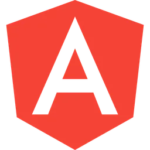
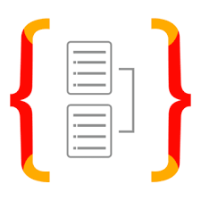
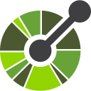
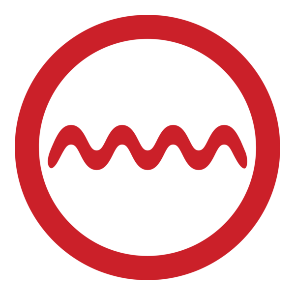
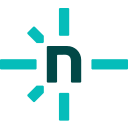

# Bem-vindo ao meu perfil 👋
Olá, tudo bem? Sou o Rodrigo. Muito prazer!

Cursei um Técnico em Mecânica durante o ensino médio e, por gostar da área, optei pela Engenharia da USP. Para minha sorte, ao longo da graduação descobri que minha paixão mesmo era programar. Levou 1 ano para amadurecer a ideia e, finalmente, em 2023 resolvi migrar de área. Gosto bastante de aprender e transmitir conhecimento. Por isso, sempre que possível, atuo como monitor bolsista na faculdade e voluntário em um cursinho popular. Hoje trabalho como Desenvolvedor Full-stack e curso Sistemas de Informação à noite. Além de codificação, pretendo aprender mais sobre arquitetura, infraestrutura e, principalmente, produto. Como pode imaginar, o caminho é longo. Então..

Bora estudar? 🙂✌🏻

### Linguagens:

  &nbsp
  &nbsp
  &nbsp
  &nbsp
  &nbsp
  &nbsp
  
  

### Front-End:

  &nbsp
  &nbsp
  &nbsp
  &nbsp
  &nbsp
  &nbsp
  &nbsp
  &nbsp
  &nbsp
  &nbsp
  

### Back-End:

  &nbsp
  &nbsp
  &nbsp
  &nbsp
  &nbsp
  &nbsp
  &nbsp
  &nbsp
  &nbsp
  &nbsp
  &nbsp
  &nbsp
  &nbsp
  

### Mobile:

  &nbsp
  &nbsp
  &nbsp
  &nbsp

### Outros:

  &nbsp
  &nbsp
  &nbsp
  &nbsp
  &nbsp
  &nbsp
  &nbsp
  &nbsp
  &nbsp
  &nbsp
  &nbsp
  &nbsp
  &nbsp
  &nbsp
  &nbsp
  &nbsp
  &nbsp
  

